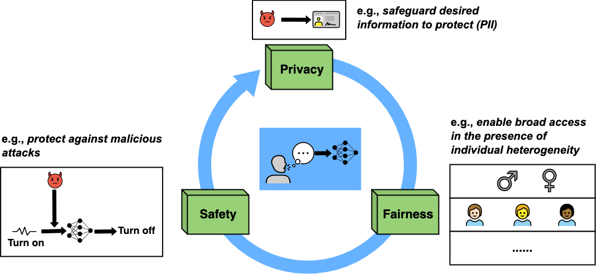

# Trustworthy Speech Emotion Recognition [[Paper Link](https://arxiv.org/abs/2305.11229)]
#### Trust-SER is an open source project for researchers exploring SER applications with trustworthiness elements

The core elements for Trustworthy Speech Emotion Recognition (The figure uses images from https://openmoji.org/):

<div align="center">
 
</div>

### Our framework support popular pre-trained speech models:

1. APC
2. TERA
3. Wav2vec 2.0
4. WavLM Base+
5. Whisper Tiny
6. Whisper Base
7. Whisper Small

To begin with, please clone this repo:
```
git clone git@github.com:usc-sail/trust-ser.git
```

To install the conda environment:
```
cd trust-ser
conda env create -f trust-ser.yml
conda activate trust-ser
```

To install the essential SUPERB audio benchmark:
```
cd model/s3prl
pip3 install -e .
```

Please specify the data file to your work dir under config/config.yml

```
data_dir:
  crema_d: CREMA_D_PATH
  iemocap: IEMOCAP_PATH
  meld: MELD_PATH
  msp-improv: MSP-IMPROV_PATH
  msp-podcast: MSP-PODCAST_PATH
  ravdess: RAVDESS_PATH
project_dir: OUTPUT_PATH
```

### Data Spliting
For most of the dataset, user need first split the train/dev/test by the given script file. Take the IEMOCAP data as instance:
```
cd train_split_gen
python3 iemocap.py
```

### Audio Preprocess
For most of the dataset, user can generate the preprocessed audio file by the given script file. The preprocessing includes resample to 16kHz and to mono channel. Take the IEMOCAP data as instance:
```
cd preprocess_audio
python3 preprocess_audio.py --dataset iemocap
# dataset: iemocap, ravdess, msp-improv, msp-podcast, crema_d
```
The script will generate the folder under your working dir:
```
OUTPUT_PATH/audio/iemocap
```


### ML training
To train with a pretrained backbone, use the following:
```
cd experiment
CUDA_VISIBLE_DEVICES=0 taskset -c 1-30 python3 finetune_single_thread.py --pretrain_model apc --dataset iemocap --learning_rate 0.0005 --downstream_model cnn --num_epochs 30 --num_layers 3 --conv_layers 2 --pooling mean --hidden_size 128

# pretrain_model: apc, tera, wavlm, wav2vec2_0, whisper_tiny, whisper_base, whisper_small
# pooling: mean, att (self-attention)
# hidden_size: size of cnn
# conv_layers: number of cnn layers
```

## Trustworthy Evaluation
### 1.Fairness Evaluation
To evaluate the fairness with a pretrained backbone and its downstream model, use the following:
```
cd trustworthy/fairness
CUDA_VISIBLE_DEVICES=0 taskset -c 1-30 python3 fairness_evaluation.py --pretrain_model apc --dataset iemocap --learning_rate 0.0005 --downstream_model cnn --num_epochs 30 --num_layers 3 --conv_layers 2 --pooling mean --hidden_size 128
```

The output will be under: OUTPUT_PATH/fariness/iemocap
The output metrics include: demographic disparity statistical_parity (Speaker-wise); equality of opportunity (Speaker-wise).

The aggregation is based on the max, which means the worst case will be the output. The lower the metric, the better the fairness.

### 2.Safety Evaluation

To evaluate the safety with a pretrained backbone and its downstream model, use the following:
```
cd trustworthy/safety
CUDA_VISIBLE_DEVICES=0 taskset -c 1-30 python3 adversarial_attack.py --pretrain_model apc --dataset iemocap --learning_rate 0.0005 --downstream_model cnn --num_epochs 30 --num_layers 3 --conv_layers 2 --pooling mean --hidden_size 128 --attack_method fgsm -snr 45
# attack_method: fgsm
# snr: SNR of the input adversarial noise
```

The output will be under: OUTPUT_PATH/attack/iemocap
The output metrics is attack success rate, and the higher the metric, the worse the safety.

### 3.Privacy (Speaker recognition TBA)

```
CUDA_VISIBLE_DEVICES=0, taskset -c 90-120 python3 gender_inference.py --pretrain_model $pretrain_model --dataset $dataset --learning_rate 0.00005 --downstream_model cnn --num_epochs 10 --num_layers 3 --conv_layers 2 --pooling mean --hidden_size 128 --privacy_attack gender
```

The output will be under: OUTPUT_PATH/privacy/gender/iemocap
The output metrics is gender prediction accuracy, and the higher the metric, the worse the privacy (We are adding the support for speaker recognition).
